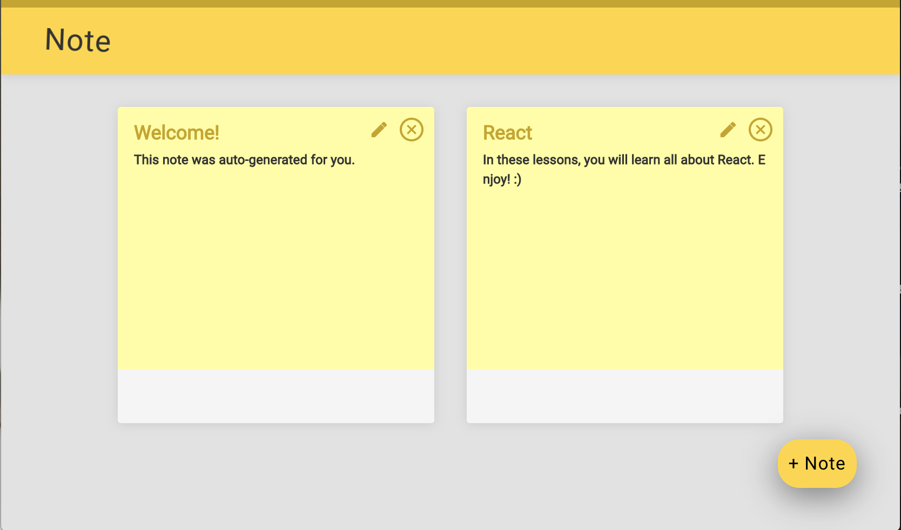
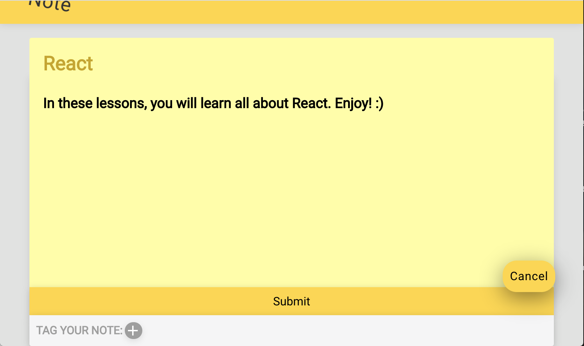
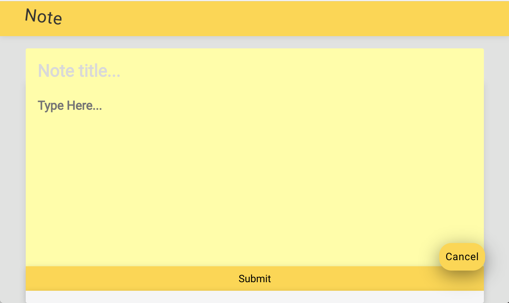

# Note App #

Dynamic note taking app with a fluid user interface that uses Facebook's ReactJS, JavaScript/ES6, and Axios.
  
<b>Other Tools & Languages:</b> Rails API, JSON, AJAX, HTML, CSS

## Table of Contents ##
<ul> 
  <li><a href="#about"> About </a></li>
  <li><a href="#technologies"> Built With </a></li>
  <li><a href="#setup"> Getting Started </a></li>
  <li><a href="#usage"> Deployment </a></li>
  <li><a href="#contact"> Contact</a></li>
</ul>

 

## About ##
This simple note taking app is similar to the Note App on our IPhones. Users may create, edit, delete, and tag notes. 

 

## Built With ##
Note App integrates the following: 
<ul>
  <li>Git</li>
  <li>Heroku</li>
  <li>NVM</li>
  <li>Node and NPM</li>
  <li>Yarn</li>
  <li>ReactJS and Developer tools</li>
  <li>Axios</li>
</ul>

 

## Getting Started ##
Requires Git and Heroku CLI

### Setting Up Backend ###
With your Ruby/Rails backend, create the application on Heroku by using the heroku create command—and make sure to give it a unique name:
<pre>$ heroku create note-api-your-unique-name</pre>

Once the application is created, push the latest code up to your new Heroku app:
<pre>$ git push heroku master</pre>

The command will take some time to finish. When it does, you'll need to run the command to run the database migrations and seed the database with premade notes:
<pre>$ heroku run rake db:migrate db:seed</pre>

Exit the Heroku Rails console:
<pre>$ exit</pre>

Check to see that your app works. Run the following command to get the information about the application:
<pre>$ heroku apps:info</pre>

Add /notes to the end of the URL the previous command spit out to view a working API:
<pre>https://note-api-your-unique-name.herokuapp.com/notes</pre>

### Set Up Development Environment ###
Install <a href="https://github.com/nvm-sh/nvm">NVM</a> 
Install <a href="https://www.npmjs.com/get-npm">Node and NPM</a> 
Install Yarn 
<pre>$ npm install yarn -g</pre>

### Set Up Front End ###
Install React Using NPM

Update NPM to use the latest version:
<pre>$ npm install npm@latest -g</pre>

Next, install the latest version of create-react-app globally:
<pre>$ npm install -g create-react-app</pre>

Next, using the cd command, navigate to the folder where you want the project to exist, and build a new project with create-react-app called note-app. This generates a basic React application that you can add code in:
<pre>$ create-react-app note-app</pre>

The project should be generated in your environment. Now Navigate to the newly built note-app folder and open the folder in a text editor.
<pre>$ npm start</pre>

Visit the URL to make sure everything is working. 
localhost:3000; if you're using Vagrant, visit localhost:3030. If you're developing natively, your browser might open automatically.

Then, install <a href="https://chrome.google.com/webstore/detail/react-developer-tools/fmkadmapgofadopljbjfkapdkoienihi?hl=en">React Developer Tool</a> in your web browser.

Finally, turn this project into a Git project and Set up Heroku for deployment. 
<pre><code>create new Github repository
create project in heroku and then deploy it to heroku</code></pre>

** To perform HTTP requests, install AXIOS

** View <a href="https://blog.teamtreehouse.com/deploy-static-site-heroku">here</a> to convert application to deploy to Heroku. 

 

## Deployment ##

This live project can be view at: https://note-app-robyn-wang.herokuapp.com/

And it's code can be found at: https://github.com/robynwang314/noteapp

### Screenshots ###

 &nbsp;&nbsp;&nbsp;

 
 

 

## Contact ##

<ul>
  <li><a href="http://robynwang-portfolio.herokuapp.com/" target="_blank">Portfolio</a></li>
  <li><a href="https://www.linkedin.com/in/tyrobynwang" target="_blank">LinkedIn</a></li>
  <li><a href="https://github.com/robynwang314" target="_blank">GitHub</a></li>
</ul>

